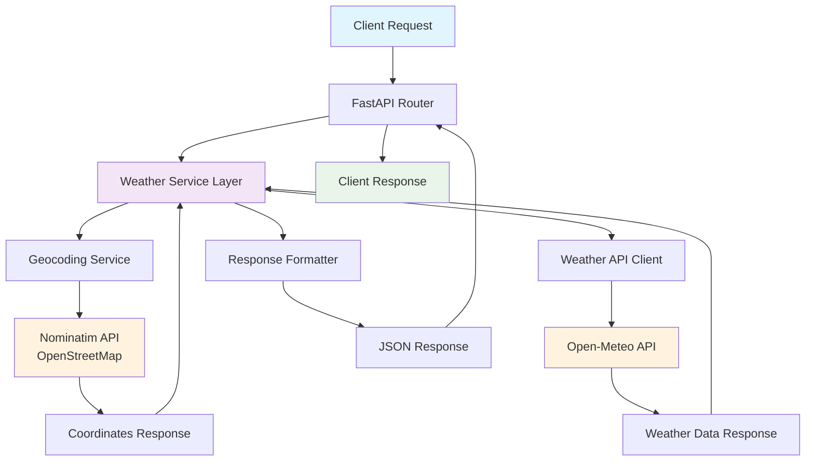

# Weather Service API

A Python webservice that provides weather information for cities using the Open-Meteo API.

## Features

- **City Weather Lookup**: Get current temperature for any city by name
- **Automatic Geocoding**: Converts city names to coordinates using Nominatim
- **Open-Meteo Integration**: Fetches weather data from the free Open-Meteo API
- **REST API**: FastAPI-based web service with automatic documentation
- **Error Handling**: Comprehensive error handling for invalid cities and API failures

## API Endpoints

- `GET /` - API information and available endpoints
- `GET /weather/{city_name}` - Get current temperature for a city
- `GET /health` - Health check endpoint
- `GET /docs` - Interactive API documentation (Swagger UI)

## Installation

### Option 1: Docker (Recommended)

The easiest way to run the Weather Service is using Docker with nginx as a reverse proxy:

```bash
# Build the Docker image using the build scripts
./scripts/build.sh        # Linux/macOS
scripts\build.bat         # Windows

# Or build manually
docker build -f docker/Dockerfile -t weather-service:latest .

# Run the container
docker run -p 80:80 weather-service:latest
```

Or use docker-compose for easier management:

```bash
# Start the service
cd docker && docker-compose up -d

# Stop the service
cd docker && docker-compose down
```

The service will be available at `http://localhost` (port 80).

### Option 2: Local Development

1. Make sure you have Python 3.7+ installed
2. Install dependencies:

   ```bash
   pip install -r requirements.txt
   ```

## Usage

### Start the Server

#### Docker Deployment

After building the Docker image:

```bash
# Using Docker directly
docker run -p 80:80 weather-service:latest

# Using docker-compose
docker-compose up -d
```

The server will start on `http://localhost` (port 80).

#### Local Development

Option 1 - Using the startup scripts (recommended):

```bash
# Linux/macOS
./scripts/start.sh

# Windows
scripts\start.bat
```

Option 2 - Using Python directly:

```bash
# From project root
python -m uvicorn src.main:app --host 0.0.0.0 --port 8000
```

Option 3 - Development mode (with auto-reload):

```bash
python src/run_server.py
```

Option 4 - Simple mode:

```bash
python src/start_server.py
```

The server will start on `http://localhost:8000`

### API Examples

#### Docker Deployment (port 80)

- Get weather for London: `http://localhost/weather/London`
- Get weather for New York: `http://localhost/weather/New York`
- Get weather for Tokyo: `http://localhost/weather/Tokyo`
- Health check: `http://localhost/health`
- API documentation: `http://localhost/docs`

#### Local Development (port 8000)

- Get weather for London: `http://localhost:8000/weather/London`
- Get weather for New York: `http://localhost:8000/weather/New York`
- Get weather for Tokyo: `http://localhost:8000/weather/Tokyo`

### Example Response

**Success Response:**

```json
{
  "city": "London",
  "result": "15 Celsius now in London"
}
```

**Error Response:**

```json
{
  "detail": "Error getting weather for 'InvalidCity': City 'InvalidCity' not found"
}
```

### Testing

Option 1 - Using pytest (recommended):

```bash
# Run all tests
pytest tests/

# Run specific test files
pytest tests/test_direct.py
pytest tests/test_service.py
```

Option 2 - Direct functionality test (no server needed):

```bash
python tests/test_direct.py
```

Option 3 - Full API test (requires server to be running):

```bash
python tests/test_service.py
```

Option 4 - Simple client usage:

```bash
python src/client.py London
python src/client.py "New York"
python src/client.py Tokyo
```

## Dependencies

- **FastAPI**: Modern web framework for building APIs
- **Uvicorn**: ASGI server for FastAPI
- **Requests**: HTTP library for API calls
- **Geopy**: Geocoding library for converting city names to coordinates

## API Documentation

Once the server is running, visit `http://localhost:8000/docs` for interactive API documentation.

## How It Works

1. **City Input**: User provides a city name via the API endpoint
2. **Geocoding**: The service uses Nominatim (OpenStreetMap) to convert the city name to latitude/longitude coordinates
3. **Weather API Call**: Using the coordinates, the service calls the Open-Meteo API to get current weather data
4. **Response Formatting**: The temperature is formatted as "{temperature} Celsius now in {city}"
5. **Error Handling**: If the city is not found or the weather data is unavailable, an appropriate error message is returned

## Example Usage from Command Line

### Docker (port 80)

```bash
# Using curl
curl http://localhost/weather/London

# Using PowerShell
Invoke-RestMethod -Uri "http://localhost/weather/London"
```

### Local Python (port 8000)

```bash
# Using curl
curl http://localhost:8000/weather/London

# Using PowerShell
Invoke-RestMethod -Uri "http://localhost:8000/weather/London"
```

## Architecture

The Weather Service API follows a layered architecture with clear separation of concerns:



### Component Overview

- **FastAPI Router**: Handles HTTP requests and routes them to appropriate handlers
- **Weather Service Layer**: Core business logic that orchestrates the weather lookup process  
- **Geocoding Service**: Converts city names to latitude/longitude coordinates using Nominatim
- **Weather API Client**: Fetches current weather data from Open-Meteo API
- **Response Formatter**: Formats the weather data into user-friendly JSON responses

### Data Flow

1. Client sends GET request to `/weather/{city_name}`
2. FastAPI routes the request to the weather service
3. Service calls geocoding to get coordinates for the city
4. Service uses coordinates to fetch weather data from Open-Meteo
5. Service formats the response and returns it to the client
6. Error handling occurs at each step with appropriate HTTP status codes

## CI/CD Pipeline

This project uses GitHub Actions for continuous integration and deployment with the following features:

### Pipeline Stages

1. **Test Stage**
   - Runs comprehensive unit and integration tests using pytest
   - Enforces minimum 75% code coverage requirement
   - Fails the build if coverage threshold is not met
   - Uploads coverage reports to Codecov

2. **Build and Security Scan Stage**
   - Builds Docker image using the project's secure Dockerfile
   - Performs comprehensive security vulnerability scanning using Trivy
   - **Security Fail Conditions**: Fails the build if CRITICAL or HIGH vulnerabilities are found
   - Generates both SARIF and JSON vulnerability reports
   - Uploads security scan results to GitHub Security tab for monitoring
   - Stores vulnerability reports as workflow artifacts for analysis

3. **Deploy Stage** (main branch only)
   - Automatically increments the minor version in `pyproject.toml`
   - Tags and pushes the Docker image to GitHub Container Registry (ghcr.io)
   - **Release Security Scanning**: Performs additional vulnerability scans on release images
   - Creates a new Git tag with the updated version
   - Generates a GitHub release with changelog and Docker pull commands
   - Pushes version changes back to the repository

### Docker Image Registry

Docker images are automatically published to GitHub Container Registry:

```bash
# Pull the latest version
docker pull ghcr.io/willbender/simple-weather-app:latest

# Pull a specific version
docker pull ghcr.io/willbender/simple-weather-app:1.1.0
```

### Security Scanning

Every build includes comprehensive security scanning with strict fail conditions:

- **Container Image Scanning**: Trivy scans the Docker image for known vulnerabilities
- **Automated Security Failures**: Builds fail automatically if CRITICAL or HIGH vulnerabilities are detected
- **Dependency Scanning**: Python dependencies are analyzed for security issues
- **SARIF Integration**: Results are uploaded to GitHub's Security tab for easy monitoring
- **Multi-Format Reports**: Both SARIF (for GitHub integration) and JSON (for detailed analysis) formats
- **Release Security**: Additional security scans performed on every release to prevent vulnerable deployments

### Docker Security Hardening

The project uses a security-hardened multi-stage Docker build:

- **Updated Base Images**: Uses Python 3.12-slim (latest LTS) for security patches
- **Minimal Attack Surface**: Removes unnecessary packages after installation
- **Alpine Consistency**: Properly configured Alpine Linux usage in build stages  
- **Nginx Security**: Updated to nginx:1.26-alpine for latest security updates
- **Non-root User**: Runs application processes as non-privileged user
- **Clean Build Layers**: Comprehensive cleanup of caches and temporary files

### Version Management

- **Automatic Versioning**: Minor version increments on every main branch deployment
- **Semantic Versioning**: Follows semver format (MAJOR.MINOR.PATCH)
- **Git Tagging**: Each release is tagged in Git for traceability
- **Release Notes**: Automated GitHub releases with Docker pull instructions

### Workflow Triggers

- **Push to main**: Full pipeline including deployment
- **Push to develop**: Test and build stages only
- **Pull Requests**: Test and build stages for validation

The CI/CD pipeline ensures code quality, security, and reliable deployments while maintaining full traceability of all releases.
